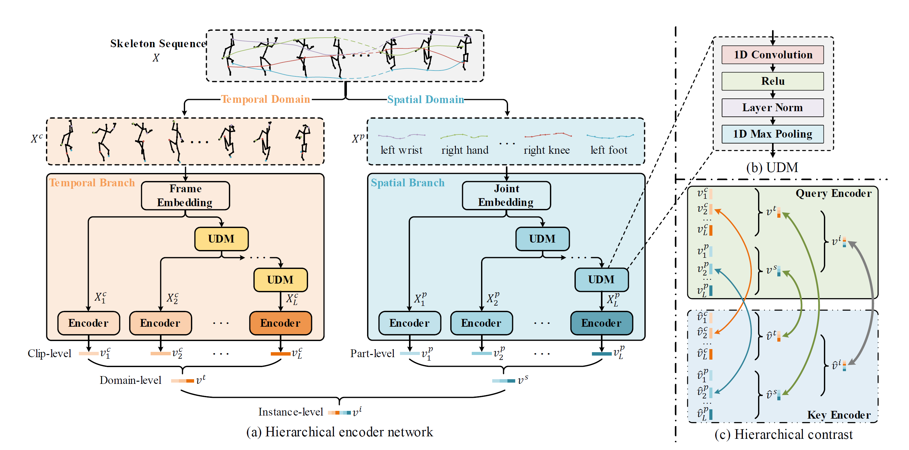
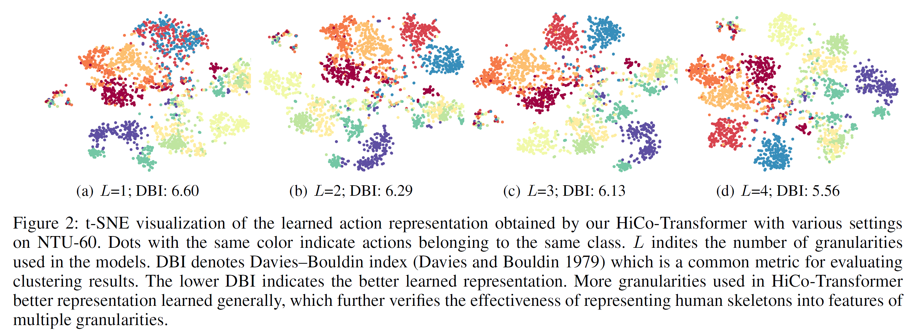

# Hierarchical Contrast for Unsupervised Skeleton-based Action Representation Learning
This is a repository contains the implementation of our AAAI'23 oral paper [Hierarchical Contrast for Unsupervised Skeleton-based Action Representation Learning](https://arxiv.org/abs/2212.02082).



## Requirements
   
Use the following instructions to create the corresponding conda environment. 
```
conda create -n hico python=3.9 anaconda
conda activate hico
conda install pytorch==1.12.1 torchvision==0.13.1 torchaudio==0.12.1 -c pytorch
pip3 install tensorboard
```

## Data Preparation
- Download raw [NTU-RGB+D 60 and 120 skeleton data](https://github.com/shahroudy/NTURGB-D) and save to ./data folder.
```
- data/
  - nturgbd_raw/
    - nturgb+d_skeletons/
      ...
    - samples_with_missing_skeletons.txt
  - nturgbd_raw_120/
    - nturgb+d_skeletons/
      ...
    - samples_with_missing_skeletons.txt
```
- Preprocess data with with `data_gen/ntu_gendata.py`.
```
cd data_gen
python ntu_gendata.py
```
<!--- - For convenience, we also provide preprocessed data in Google Drive. [(upcoming)](). -->
<!--- - After preprocessing, replace the [data_path](https://github.com/HuiGuanLab/HiCo/blob/081f97dd341e6e1a5884d7e75a9189aa233e96a3/options/options_pretraining.py#L17) with your data location in the option files (`option_pretraining.py`, `option_classification.py` and `option_retrieval.py`). -->

## Pretraining and Evaluation
HiCo consumes less (due to smaller encoders and queues), so we only implemented single GPU training.
#### Unsupervised Pretraining
- Run the following script for pretraining. It will save the checkpoints to `./checkpoints/$TEST_NAME/`.
```
./run_pretraining.sh $CUDA_DEVICE $TEST_NAME $DATASET $PROTOCOL $REPRESENTATION
```
`$CUDA_DEVICE` is the ID of used GPU.  
`$TEST_NAME` is the name of the folder where the checkpoints are saved in.  
`$DATASET` is the dataset to use for unsupervised pretraining (ntu60 or ntu120).  
`$PROTOCOL` means training protocol (cross_subject/cross_view for ntu60, and cross_subject/cross_setup for ntu120).  
`$REPRESENTATION` is the input skeleton representation (joint or bone or motion).
- An example of pretraining on NTU-60 x-view joint stream.
```
./run_pretraining.sh 0 ntu60_xview_joint ntu60 cross_view joint
```

#### Downstream Task Evaluation
- **Task1: Skeleton-based action recognition**. Train a linear classifier on pretrained query encoder. The parameter meaning is the same as above.
```
./run_action_classification.sh $CUDA_DEVICE $TEST_NAME $DATASET $PROTOCOL $REPRESENTATION
```
It will automatically evaluate on the checkpoint of the last epoch obtained from pretraining. The following example is an evaluation for the previous pretraining on NTU-60 x-view joint stream.
```
./run_action_classification.sh 0 ntu60_xview_joint ntu60 cross_view joint
```

- **Task2: Skeleton-based action retrieval**. Apply a KNN classifier on on pretrained query encoder. It's similar to action recognition, here is an example. 
```
./run_action_retrieval.sh 0 ntu60_xview_joint ntu60 cross_view joint
```


## Pretrained Models
We release several pretrained models:
- HiCo-GRU on NTU-60 and NTU-120: [released_model](https://drive.google.com/drive/folders/1gg_duJfAhKHp5OiTjLRegUSbS6ltw9s8?usp=sharing)
- HiCo-LSTM on NTU-60 and NTU-120: [released_model](https://drive.google.com/drive/folders/1plsXniflfZCRLDdeagK97ciAoWBhcDDU?usp=sharing)
- HiCo-Transformer on NTU-60 and NTU-120: [released_model](https://drive.google.com/drive/folders/163Fy2EKM-umuYC1-znQgNCdmQxvxRt2o?usp=sharing)  

Expected performance on skeleton-based action recognition:  

|     Model        | NTU 60 xsub (%) | NTU 60 xview (%) |   NTU 120 xsub (%)   |   NTU 120 xset (%)   |
| :--------------: | :-------------: | :--------------: | :-----------------:  | :-----------------:  |
| HiCo-GRU         |      80.6      |      88.6         |       72.5           |      73.8            |
| HiCo-LSTM        |      81.4      |      88.8         |       73.7           |      74.5            |
| HiCo-Transformer |      81.1      |      88.6         |       72.8           |      74.1            | 

## Visualization
We utilize [t-SNE](https://www.jmlr.org/papers/volume9/vandermaaten08a/vandermaaten08a.pdf) to visualize the learned action representation obtained by our HiCo-Transformer models with different granularities on NTU-60 xsub.


## Citation
If you find this repository useful, please consider citing our paper:
```
@inproceedings{hico2023,
  title={Hierarchical Contrast for Unsupervised Skeleton-based Action Representation Learning},
  author={Jianfeng Dong and Shengkai Sun and Zhonglin Liu and Shujie Chen and Baolong Liu and Xun Wang},
  booktitle={Proceedings of the AAAI Conference on Artificial Intelligence},
  year={2023}
}

```

## Acknowledgement
The framework of our code is based on [skeleton-contrast](https://github.com/fmthoker/skeleton-contrast).  
  
This work was supported by the NSFC (61902347, 
62002323, 61976188), the Public Welfare Technology Research
Project of Zhejiang Province (LGF21F020010), the
Open Projects Program of the National Laboratory of Pattern
Recognition, the Fundamental Research Funds for the
Provincial Universities of Zhejiang.
